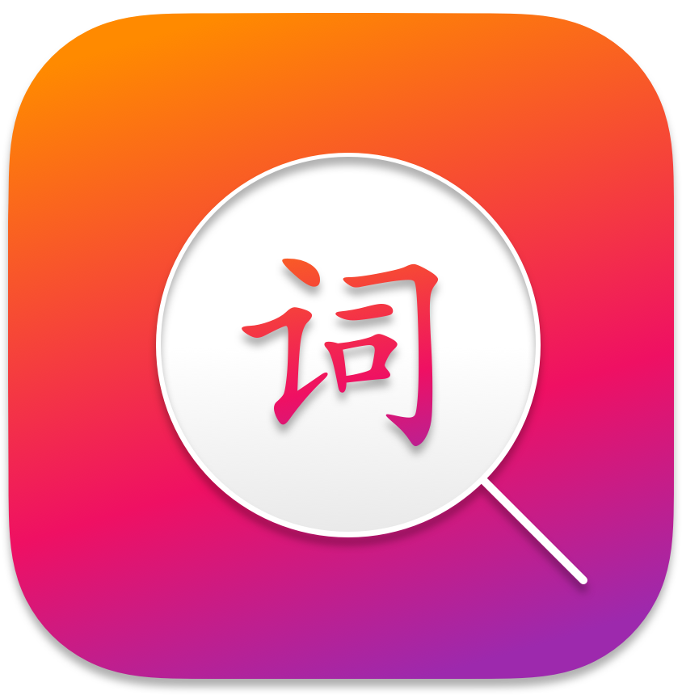

    </img>

# __Syng | 词应__
##### Dictionary App | 词典应用

##### Don't just learn Chinese, master it.

## __About__
Syng is a free, cross-platform, open-source, Chinese-To-English and English-To-Chinese dictionary. Syng is your study assistant to help you learn Chinese no matter where you are in your journey. 

Syng v2 is now in beta. Please be patient as features get ported over from v1. In addition to a new interface, Syng v2 includes several under-the-hood enhancements on top of v1 that enable the possibility of more advanced features.

## __What's new?__
Check out the [release page](https://github.com/sotch-pr35mac/syng/releases) for the latest information on new features and fixes.

Syng v2 is a ground-up rewrite focussing on speed and user experience. Due to that, Syng v2 doesn't yet have feature parity with v1. The list below is a non-exhaustive reference for the features that have been ported to v2. 

- [x] Search (in English, traditional/simplified Chinese, and Pinyin)
- [x] Offline Support
- [x] Cross Platform Support (macOS, Windows, Linux)
- [x] Character Stroke Animations
- [x] Bookmarks
- [ ] Flash cards & Quizes
- [ ] Reader
- [ ] Prettify Pinyin
- [ ] Character Converter
- [ ] Pinyinify

## __Screenshots__
More screenshots available on [the Syng website](https://www.getsyng.com).

## __Name__

Syng is a stylized spelling of cíyīng, the Pinyin for 词应. 词应 has been shorted from 词典应用, literally translating to Dictionary App.

## __v1__

Syng v1 is no longer maintained. Installation instruction and more information can be found in the [version 1 archive](https://github.com/sotch-pr35mac/syng/tree/v1).

## __License__
This software is licensed under the [GNU Public License 3](https://www.gnu.org/licenses/gpl-3.0.en.html).
