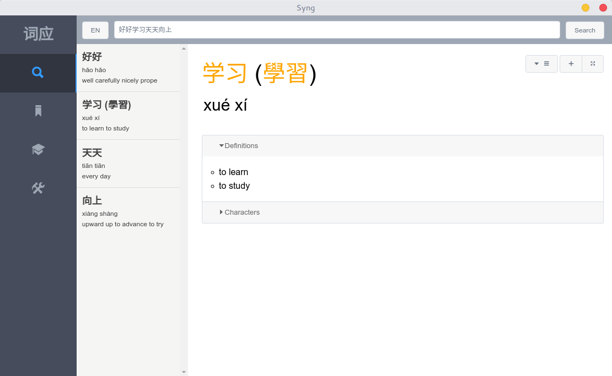

<p align="center">
    </img>
</p>

# __Syng | 词应__
##### Dictionary App | 词典应用

## __Notice__

This legacy version of Syng is no longer maintained. This branch serves as an archive only. For more information on the current state of Syng checkout the [main branch](https://github.com/sotch-pr35mac/syng/tree/master).

## __About__

Syng is a free, open source, Chinese-To-English and English-To-Chinese Dictionary app that makes it easy to lookup words and phrases quickly. Currently Syng works on macOS, Windows, and Linux systems.

### Name
Syng is a stylized spelling of cíyīng, the Pinyin for 词应. 词应 has been shorted from 词典应用, literally translating to Dictionary App.

## __Features__
- ___Search___
    - Syng allows you to search by Pinyin, English, and Chinese characters (both traditional and simplified)
- ___Study___
    - Syng makes it easy to study Chinese by creating flash cards out of your saved words and searches.
    - Syng also tests you on your knowledge and progress of your Chinese to measure your language development.
- ___Bookmarks___
    - Syng allows you to save words and searches to your bookmarks, so that you can reference them later, and even create custom vocab lists.
- ___Reader___
    - Syng lets you read Chinese text from your clipboard or from the web with an easy to use popup dictionary.
- __Offline Support__
    - No internet connection required for most features
- __Cross-Platform__
    - Mac OS X
    - Windows
    - Linux
- __Prettify Pinyin__
    - Convert pinyin with tone numbers with tone marks
- __Convert Characters__
    - Convert between traditional and simplified characters
- __Pinyinify__
    - Convert 汉字 into hànzì. Turn characters into pinyin
- __Character Stroke Animations__
    - View character stroke order animations to study writing characters

## __What's new?__
These are few feature additions and visual changes in v1.5.0. For a full list of changes, see [the changelog](https://github.com/sotch-pr35mac/syng/blob/master/CHANGELOG.md).
1. Added support for custom tone colors

## __Screenshots__
More screenshots available on [the Syng website](https://www.getsyng.com).



## __Installing__
#### __Linux__
To install Syng on Linux, you can you use the pre-built installation script by copy and pasting the code below into terminal. __It's good to be cautious about what you are putting in your terminal, you can read the 64-bit install script [here](https://gist.github.com/sotch-pr35mac/3120195991d8879ef82569720371f18d) and the 32-bit install script [here](https://gist.github.com/sotch-pr35mac/24f6dd51f405ccbb84a8be578bf70437).__

For 64-bit systems:
```
wget -O- https://bit.ly/2weiJxU | bash
```
For 32-bit systems:
```
wget -O- https://bit.ly/2OLXtay | bash
```

Alternatively, if you aren't comfortable running the pre-built installation script, you can install manually by downloading the 64-bit candidate [here](https://github.com/sotch-pr35mac/syng/releases/download/v1.3.0/Syng-linux-x64.tar.xz) and the 32-bit candidate [here](https://github.com/sotch-pr35mac/syng/releases/download/v1.3.0/Syng-linux-ia32.tar.xz) and then following the installation instructions provided.
#### __macOS__
To install Syng on macOS, simply download the `.dmg` file from [here](https://github.com/sotch-pr35mac/syng/releases/download/v1.4.1/Syng-macOS.dmg) and then drag and drop the Syng app into your Applications folder.
#### __Windows__
To install Syng on Windows, you can download the 64-bit installer from [here](https://github.com/sotch-pr35mac/syng/releases/download/v1.2.0/Syng-Windows-setup-x64.exe) and the 32-bit installer from [here](https://github.com/sotch-pr35mac/syng/releases/download/v1.2.0/Syng-Windows-setup-ia32.exe) and use it to install Syng.

## __Maintainers__
- [Preston Wang-Stosur-Bassett](http://www.stosur.info)

## __License__
This software is licensed under the [GNU Public License 3](https://www.gnu.org/licenses/gpl-3.0.en.html). The file at `app/src/db/cc-cedict.json` is licensed under the [Creative Commons Attribution-Share Alike 3.0 License](http://creativecommons.org/licenses/by-sa/3.0/).
