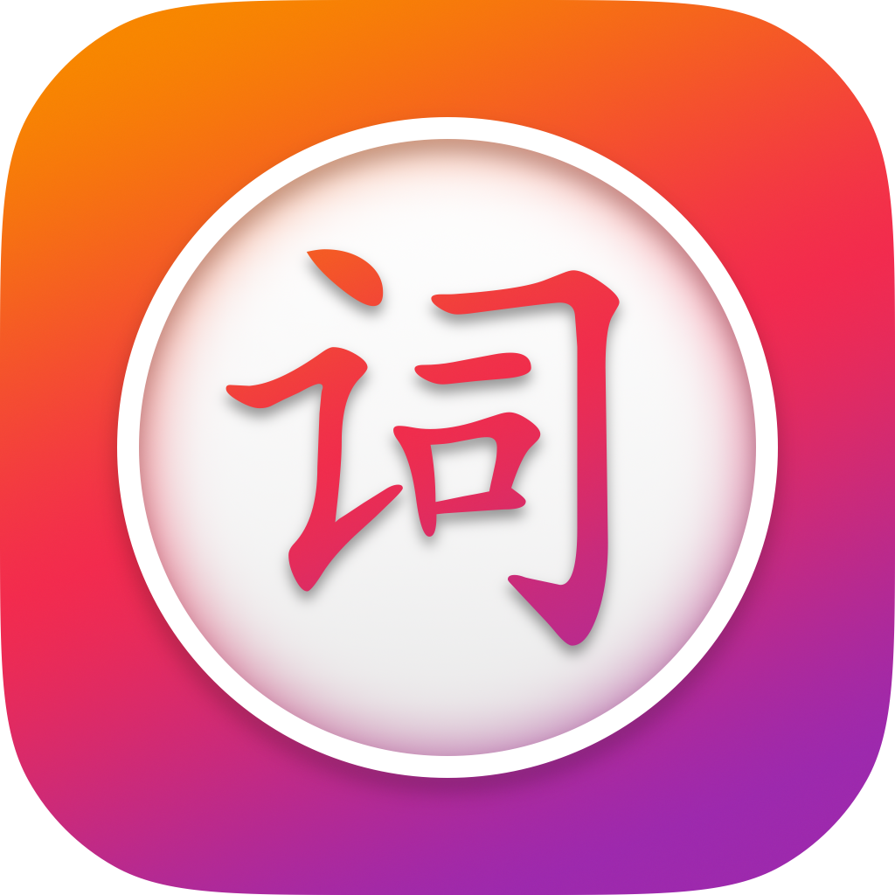
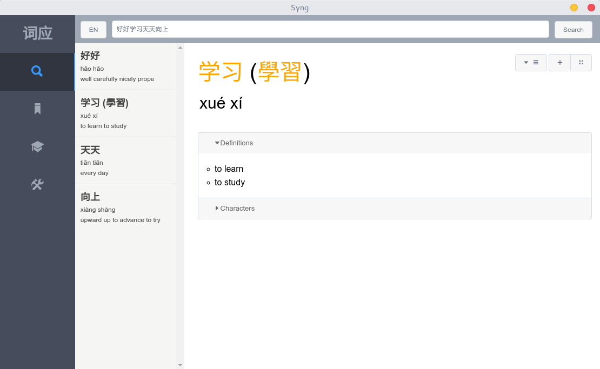

    </img>

# __Syng | 词应__
##### Dictionary App | 词典应用

##### Don't just learn Chinese, master it.

## __About__
Syng is a free, cross-platform, open-source, Chinese-To-English and English-To-Chinese dictionary. Syng is your study assistant to help you learn Chinese no matter where you are in your journey.

## __What's new?__
Check out the [release page](https://github.com/sotch-pr35mac/syng/releases) for the latest information on new features and fixes.

Syng v2 is now officially out of beta! Syng v2 is a ground-up rewrite focusing on speed and user experience. Syng v2 now has feature parity with v1.

## __Screenshots__
More screenshots available on [the Syng website](https://www.getsyng.com).

## __Name__

Syng is a stylized spelling of cíyīng, the Pinyin for 词应. 词应 has been shortened from 词典应用, literally translating to Dictionary App.

## __v1__

Syng v1 is no longer maintained. Installation instructions and more information can be found in the [version 1 archive](https://github.com/sotch-pr35mac/syng/tree/v1).

## __License__
This software is licensed under the [GNU General Public License 3](https://www.gnu.org/licenses/gpl-3.0.en.html) (see [`LICENSE`](./LICENSE)).

Additional permission is granted under GPLv3 §7 allowing distribution through application stores (Apple App Store / Mac App Store, Google Play, Microsoft Store) whose terms would otherwise be incompatible with the GPL — see [`LICENSE-APP-STORE-EXCEPTION`](./LICENSE-APP-STORE-EXCEPTION). Third-party components are listed with their licenses on the in-app Acknowledgements screen and under [`src/native/resources/licenses/`](./src/native/resources/licenses/).
